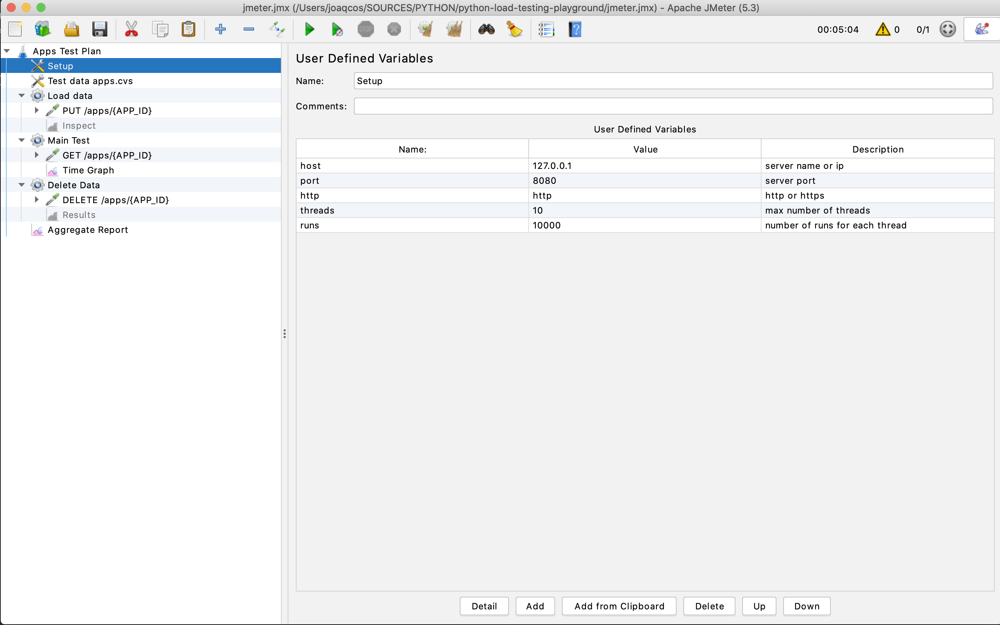
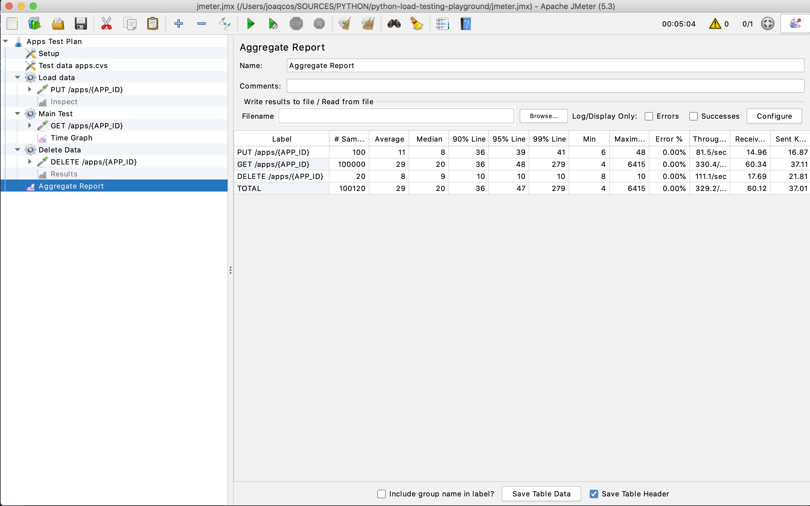
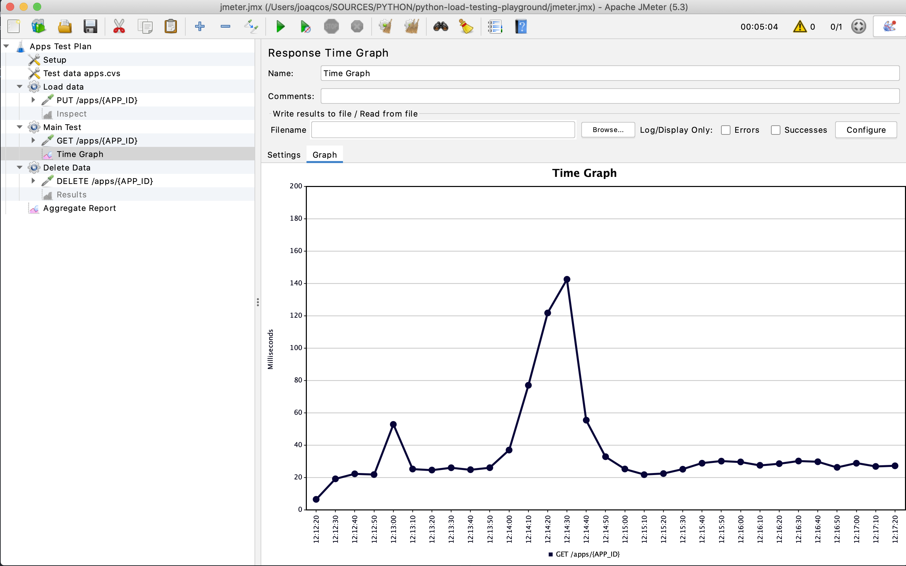
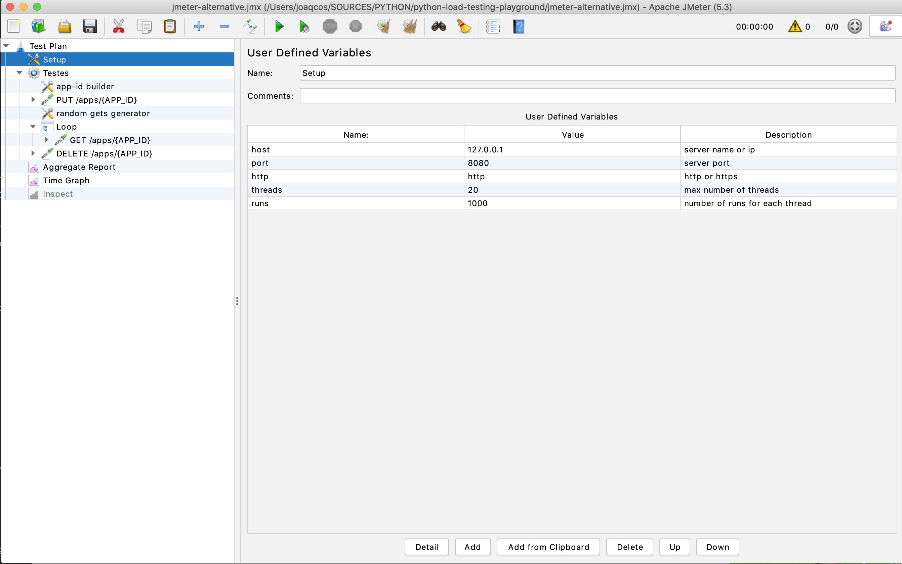
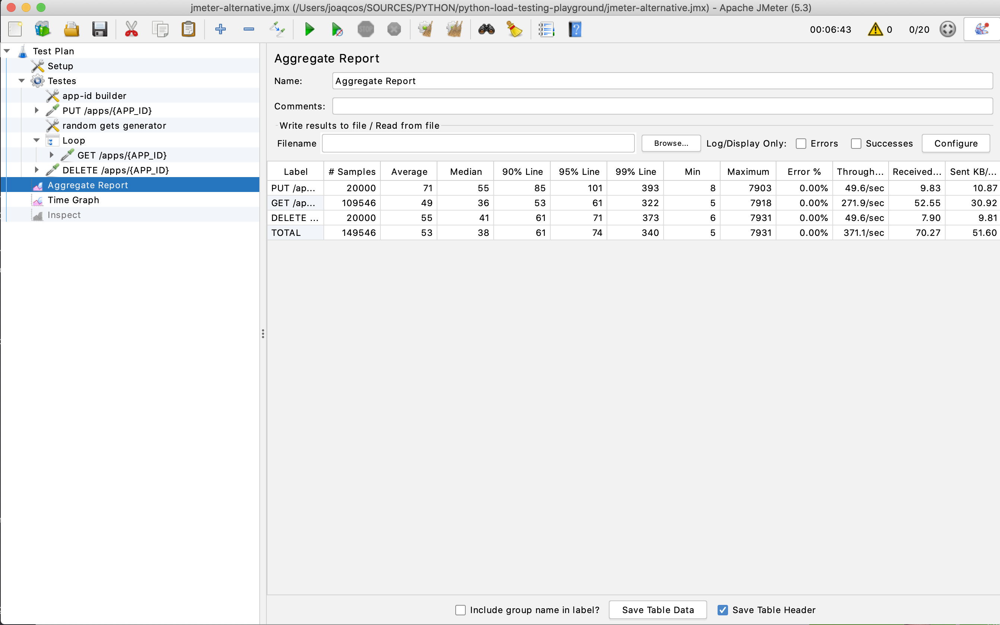
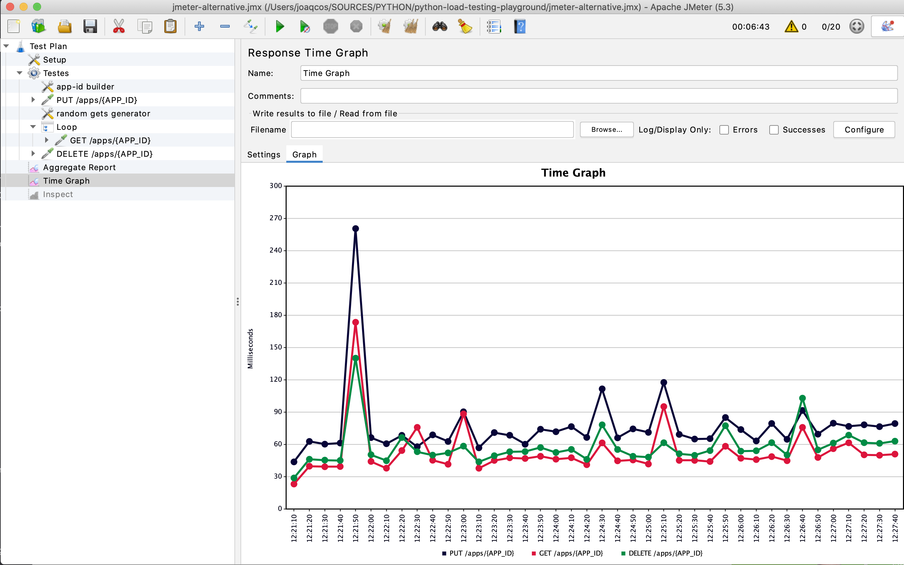

Load Testing Playground
=======================

#   for the Tested Application

1. The frameworks being tested will implement the following endpoints:
  * `PUT /apps/{app_id}` - With Body: 
    ```json
    {"app-id": {app-id}, "name": "{app name}"}
    ```
  * `GET /apps/{app_id}`
  * `DELETE /apps/{app_id}`
  2. The endpoinds should be available on `127.0.0.1:8080`
3. Data must be stored on a `Postgres 12` database


# Frameworks

Currently we have the following implementations:
* Python
  * [Flask](flask)


# Load Testing
## Testing With Beast (https://github.com/jjmrocha/beast)

___Setup___

You can install `the Beast` from [here](https://github.com/jjmrocha/beast/releases)

___Content___

* A CSV file with test data: `apps.csv`
* Requests templates for GET, PUT and DELETE: 
  * `apps_get.yaml`
  * `apps_put.yaml`
  * `apps_delete.yaml`
* Shell scripts to invoke `the Beast`:
  * `beast_put.sh`
  * `beast_delete.sh`
  * `apps_get.yaml` this one allows you to pass the number of requests and the number of concurrent requests

___How to Test___

1. Run script `beast_put.sh` to load data to the database
2. Run script `apps_get.sh` with different number of concurrent requests to check how the app keep up with the load:

    ```commandline
    % ./beast_get.sh 10000 10
    ===== System =====
    Operating System: darwin
    System Architecture: amd64
    Logical CPUs: 12
    ===== Test =====
    Request template: apps_get.yaml
    Sample Data: apps.csv
    Number of requests: 10000
    Number of concurrent requests: 10
    ===== Preparing =====
    - Loading data file
    - Loading request template
    - Generating requests
    ===== Executing =====
    2020/06/13 14:07:28 [#...................] 5%
    2020/06/13 14:07:29 [##..................] 10%
    2020/06/13 14:07:30 [###.................] 15%
    2020/06/13 14:07:31 [####................] 20%
    2020/06/13 14:07:31 [#####...............] 25%
    2020/06/13 14:07:32 [######..............] 30%
    2020/06/13 14:07:33 [#######.............] 35%
    2020/06/13 14:07:34 [########............] 40%
    2020/06/13 14:07:35 [#########...........] 45%
    2020/06/13 14:07:36 [##########..........] 50%
    2020/06/13 14:07:37 [###########.........] 55%
    2020/06/13 14:07:38 [############........] 60%
    2020/06/13 14:07:39 [#############.......] 65%
    2020/06/13 14:07:40 [##############......] 70%
    2020/06/13 14:07:41 [###############.....] 75%
    2020/06/13 14:07:42 [################....] 80%
    2020/06/13 14:07:43 [#################...] 85%
    2020/06/13 14:07:44 [##################..] 90%
    2020/06/13 14:07:45 [###################.] 95%
    2020/06/13 14:07:46 [####################] 100%
    ===== Stats =====
    Executed requests: 10000
    Time taken to complete: 3m15.658850273s
    Requests per second: 511.0937
    Avg response time: 19.565885ms
    ===== Status 200 =====
    10000 requests, with avg response time of 19.565885ms
    And the following distribution:
    - The fastest request took 5.785034ms
    - 20% of requests under 13.161764ms
    - 40% of requests under 16.415209ms
    - 60% of requests under 19.785001ms
    - 80% of requests under 24.651447ms
    - The slowest request took 243.130124ms
    ```

3. Run script `beast_delete.sh` to delete the data from the database

---
## Testing With JMeter (https://jmeter.apache.org/)

___Setup___

You can download `jmeter` from [apache.org](https://jmeter.apache.org/)
or install using `brew`:

```commandline
brew install jmeter 
```

___Content___

Two `JMeter` tests plans:
* `jmeter.jmx` - Similar to the approach used for `the Beast` tests; loads data from the same file, then run multiple GET requests and finally deletes all the data 
* `jmeter-alternative.jmx` - Runs multiple parallel requests, each one:
  * Adds a new record using `PUT`
  * Runs multiple (from 1 to 10) sequential `GET` requests 
  * Finally deletes the record using `DELETE` 


___Basic Script___

Load script:
```commandline
jmeter -t jmeter.jmx
```

You can customize the test by changing the setup:


You can see the execution:


And see a graph with the GET results:



___Alternative Script___

```commandline
jmeter -t jmeter-alternative.jmx
```

You can customize the test by changing the setup:


You can see the execution:


And see a graph with the results for all endpoints:

