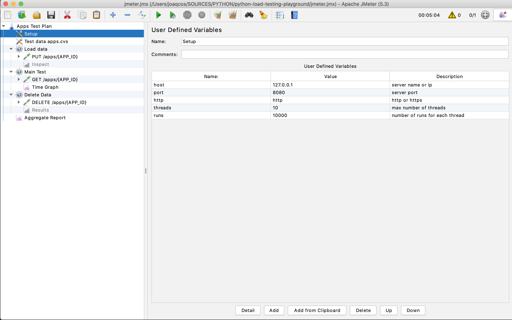
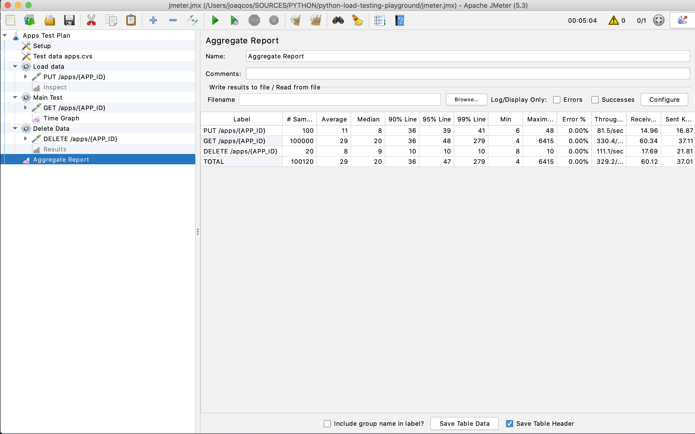
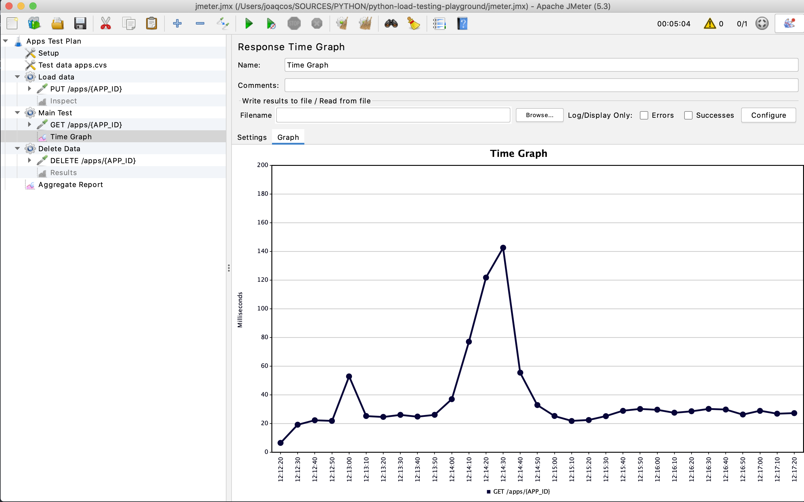
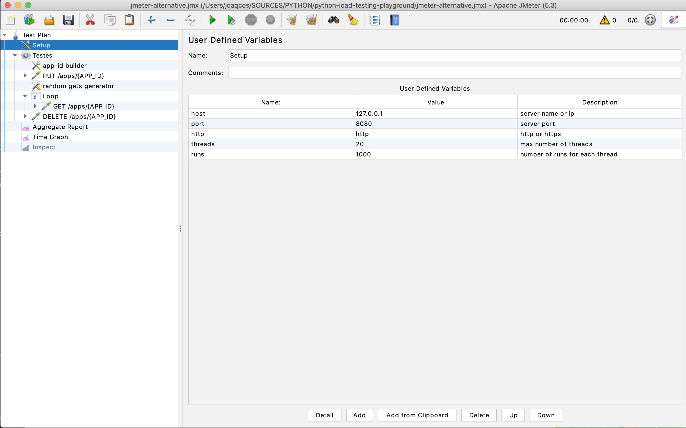
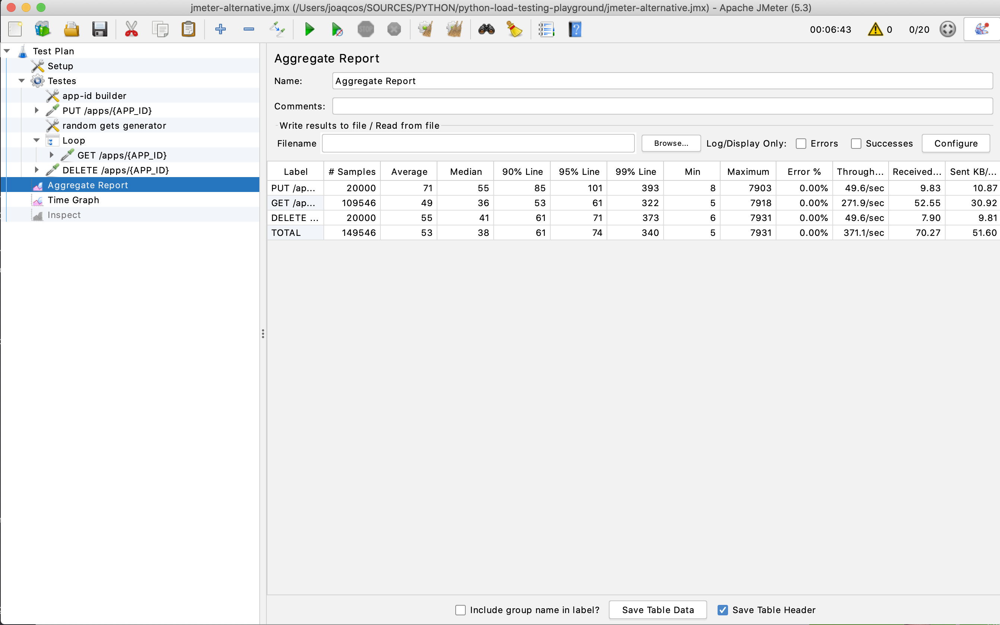
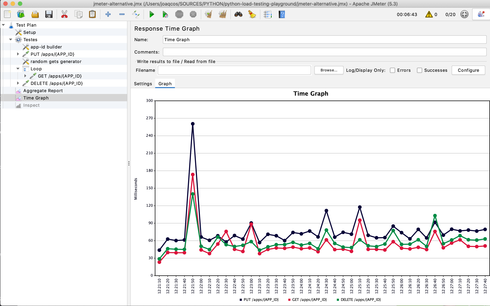

Testing With JMeter
===================
(https://jmeter.apache.org/)

Setup
-----

You can download `jmeter` from [apache.org](https://jmeter.apache.org/)
or install using `brew`:

```commandline
brew install jmeter 
```

Content
-------

Two `JMeter` tests plans:
* `jmeter.jmx` - Similar to the approach used for `the Beast` tests; loads data from the same file, then run multiple GET requests and finally deletes all the data 
* `jmeter-alternative.jmx` - Runs multiple parallel requests, each one:
  * Adds a new record using `PUT`
  * Runs multiple (from 1 to 10) sequential `GET` requests 
  * Finally deletes the record using `DELETE` 


Basic Script
------------

Load script:
```commandline
jmeter -t jmeter.jmx
```

You can customize the test by changing the setup:


You can see the execution:


And see a graph with the GET results:



Alternative Script
------------------

```commandline
jmeter -t jmeter-alternative.jmx
```

You can customize the test by changing the setup:


You can see the execution:


And see a graph with the results for all endpoints:



Non GUI Execution
-----------------

To run without GUI, you can use the command:
```commandline
jmeter -t <scrip name> -n -l <output file>
```

Example:
```
$ jmeter -t jmeter.jmx -n -l jmeter.out                                                                                    1 ↵
Creating summariser <summary>
Created the tree successfully using jmeter.jmx
Starting standalone test @ Wed Jun 17 20:14:59 WEST 2020 (1592421299872)
Waiting for possible Shutdown/StopTestNow/HeapDump/ThreadDump message on port 4445
Warning: Nashorn engine is planned to be removed from a future JDK release
summary +      1 in 00:00:00 =    6.0/s Avg:    35 Min:    35 Max:    35 Err:     0 (0.00%) Active: 1 Started: 1 Finished: 0
summary +  10119 in 00:00:13 =  791.4/s Avg:     7 Min:     2 Max:    59 Err:     0 (0.00%) Active: 0 Started: 1 Finished: 1
summary =  10120 in 00:00:13 =  781.2/s Avg:     7 Min:     2 Max:    59 Err:     0 (0.00%)
Tidying up ...    @ Wed Jun 17 20:15:13 WEST 2020 (1592421313072)
... end of run
```


Client-Server
-------------

In case a single machine is unable to simulate enough users to stress the server you can use the client-server approach and control multiple JMeter servers (running remotely) from a single JMeter client. For more information please check the [documentation](https://jmeter.apache.org/usermanual/remote-test.html)
